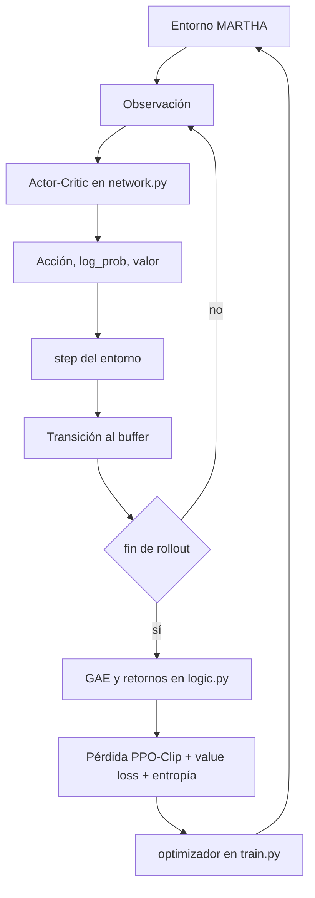
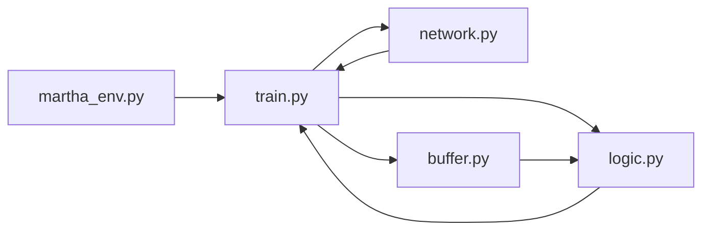

# Documentación analítica de Tesis Martha

## Marco teórico de PPO

PPO fue propuesto por Schulman y coautores como una familia de métodos de gradiente de política que alterna entre recolección de experiencia y optimización de un objetivo sustituto, con la meta de conservar la estabilidad que buscaban métodos tipo TRPO, pero con una implementación de primer orden mucho más simple. El paper original destaca que PPO logra un balance favorable entre simplicidad, complejidad temporal y eficiencia muestral. citeturn11view0

La variante más usada es **PPO-Clip**. Su idea central es comparar la nueva política con la política “vieja” que generó los datos, mediante la razón de probabilidades \(r_t(\theta)=\pi_\theta(a_t\mid s_t)/\pi_{\theta_{old}}(a_t\mid s_t)\), y luego recortar el incentivo de actualización cuando ese cociente se aleja demasiado de 1. OpenAI Spinning Up resume esta variante exactamente así: PPO-Clip no impone una restricción dura por KL, sino que usa clipping en el objetivo para remover el incentivo a cambios grandes de política. citeturn11view0turn4search0

En la práctica, el término de política se implementa como un mínimo entre el objetivo “sin recorte” \(r_t(\theta)\hat A_t\) y su versión clippeada \(\mathrm{clip}(r_t(\theta),1-\epsilon,1+\epsilon)\hat A_t\). Si la ventaja estimada \(\hat A_t\) es positiva, el clipping impide que la nueva política sobrerrefuerce una acción más allá de cierto margen; si es negativa, evita castigos desproporcionados. Ese mecanismo es la clave de la estabilidad de PPO. citeturn11view0turn4search0

La **ventaja** \(\hat A_t\) es la señal que le dice a la política si una acción fue mejor o peor de lo que esperaba el crítico. En PPO moderno, casi siempre se calcula con **Generalized Advantage Estimation**. El paper de GAE describe justamente ese objetivo: reducir la varianza de los gradientes de política introduciendo una cantidad controlada de sesgo mediante un estimador exponencialmente ponderado, análogo a TD(\(\lambda\)). citeturn11view1

En una implementación típica, primero se calculan deltas temporales \(\delta_t=r_t+\gamma V(s_{t+1})-V(s_t)\), y luego se acumulan con un factor \(\gamma\lambda\) para producir \(\hat A_t\). OpenAI Spinning Up muestra ese patrón de implementación de forma explícita en su código de referencia: agrega un valor bootstrap final, calcula deltas y luego aplica una suma acumulada con descuento para GAE-Lambda. citeturn9search9turn11view1

Además del término de política, PPO normalmente entrena una **función de valor** con una pérdida de regresión y suma un **bono de entropía** para sostener exploración. Spinning Up documenta también el conjunto de hiperparámetros estándar asociados a ese esquema —entre ellos `gamma`, `clip_ratio`, `pi_lr`, `vf_lr`, `train_pi_iters`, `train_v_iters`, `lam` y `target_kl`— lo que encaja muy bien con la arquitectura sugerida por los nombres de los archivos en tu carpeta. citeturn4search0

Un diagrama de flujo razonable para el proyecto, compatible con PPO clásico, es el siguiente:

## Lectura arquitectónica del proyecto

Dado que no fue posible inspeccionar el código fuente línea por línea, la documentación práctica por archivo debe leerse como una **lectura arquitectónica inferida**. Aun así, la inferencia es fuerte: en una implementación PPO modular en PyTorch, `train.py` suele ser el orquestador, `logic.py` concentra la matemática del algoritmo, `network.py` define el actor y el crítico, `buffer.py` conserva trayectorias on-policy, y `martha_env.py` encapsula la interfaz con el entorno. Esa partición refleja muy de cerca la organización que aparece en implementaciones de referencia como Spinning Up. fileciteturn21file0L1-L1 fileciteturn25file0L1-L1 fileciteturn26file0L1-L1 fileciteturn27file0L1-L1 fileciteturn28file0L1-L1 citeturn4search0turn9search9

`train.py` probablemente inicializa el entorno, crea el modelo, define optimizadores, itera episodios o epochs y gestiona checkpoints y métricas. En un PPO estándar, ese archivo también suele congelar los `log_probs_old`, cerrar trayectorias, invocar el cálculo de GAE y recorrer varios epochs de actualización por minibatches. `logic.py`, por su nombre, es el candidato natural para encapsular `compute_gae`, `policy_loss`, `value_loss`, `entropy_bonus` o un `ppo_update_step`. `network.py` casi con seguridad expone uno o varios `nn.Module`: una red de política, una red de valor o una clase integrada tipo `ActorCritic`. `buffer.py` debería contener métodos comparables a `store`, `finish_path`, `get` o `reset`, porque eso es exactamente lo que requiere PPO para operar en modo on-policy. `martha_env.py`, finalmente, probablemente implemente un API de entorno tipo Gymnasium o una variante local equivalente. citeturn4search0turn12search2turn12search6

La tabla siguiente resume esa lectura. Las columnas de “responsabilidad”, “entradas”, “salidas”, “dependencias” y “funciones clave” son **inferencias controladas**, no confirmaciones literales del código.

| Archivo | Responsabilidad | Entradas | Salidas | Dependencias probables | Funciones clave a validar |
|---|---|---|---|---|---|
| `train.py` | Orquestación del entrenamiento PPO, logging y checkpoints | hiperparámetros, entorno, modelo, buffer | pesos actualizados, métricas, checkpoints | `torch`, `numpy`, `logic`, `network`, `buffer`, `martha_env` | `main`, `train`, `collect_rollout`, `update`, `save_checkpoint` |
| `logic.py` | Cálculo de ventajas, retornos y pérdidas PPO | rewards, dones, values, log-probs, batches | advantages, returns, policy loss, value loss, KL, entropía | `torch`, `numpy` | `compute_gae`, `ppo_loss`, `value_loss`, `entropy_bonus` |
| `network.py` | Definición del actor, crítico y forward pass | observaciones en tensor | logits/probs o `mu/std`, `log_prob`, `value` | `torch`, `torch.nn` | `ActorCritic`, `PolicyNetwork`, `ValueNetwork`, `forward`, `act` |
| `buffer.py` | Almacenamiento de rollouts on-policy | transiciones paso a paso | batches listos para update | `numpy`, opcionalmente `torch` | `store`, `finish_path`, `get`, `reset` |
| `martha_env.py` | Entorno MARTHA o wrapper del entorno | acciones | observaciones, reward, terminación, info | `gymnasium` o API propia | `reset`, `step`, posiblemente `render` y reward logic |

Si la política es de acción **discreta**, la ruta más probable es que `network.py` produzca logits y que el cálculo de probabilidad use `softmax` o, más robustamente, `log_softmax`. Si la acción es **continua**, lo esperable es una parametrización gaussiana con medias y desviaciones estándar, seguida de cálculo de `log_prob` y `entropy`. En ambos casos, el crítico normalmente produce un valor escalar por estado. PyTorch documenta estas piezas básicas en `torch.nn.Module`, `torch.nn.Linear`, `softmax` y `log_softmax`, incluyendo la regla de que `Linear` mantiene todas las dimensiones salvo la última y transforma \(H_{in}\) en \(H_{out}\). citeturn12search2turn12search6turn7search0turn7search5

Para aterrizar esa arquitectura, el patrón de flujo más razonable es este:

## Operaciones de NumPy y PyTorch a documentar

Aunque no pude verificar cuáles aparecen exactamente en tus archivos, hay un conjunto de operaciones que, por la naturaleza de PPO, son especialmente probables y vale la pena documentar con detalle. En **NumPy**, `broadcasting` permite operar arrays de shapes diferentes sin bucles Python, siempre que las dimensiones finales sean compatibles; NumPy lo define como una expansión implícita de arrays pequeños sobre arrays más grandes, muy útil para vectorizar normalizaciones y operaciones por lote. PyTorch adopta semántica de broadcasting alineada con la de NumPy: dos tensores son broadcastables cuando sus dimensiones, vistas desde atrás, son iguales, una es 1 o una de ellas no existe. citeturn6search2turn6search0

Eso importa mucho en PPO porque casi todas las normalizaciones y muchas pérdidas operan sobre tensores con shape `(B,)`, `(B,1)` o `(B, act_dim)`. Una normalización típica de ventajas, por ejemplo, depende de broadcasting para restar una media escalar y dividir por una desviación estándar escalar a un vector completo. Del mismo modo, si la red produce logits con shape `(B, n_actions)`, el `softmax` o `log_softmax` debe aplicarse sobre la dimensión correcta para no mezclar batch con dimensión de acción. PyTorch define `softmax` como el reescalado de una rebanada a valores en \([0,1]\) cuya suma es 1, y recomienda `log_softmax` cuando interesa estabilidad numérica en log-probabilidades. citeturn7search0turn7search5

En **NumPy**, tres funciones suelen causar errores silenciosos cuando se usan sin documentarlas bien. `np.append` crea una **copia nueva** y, si no se pasa `axis`, aplana las entradas; eso es adecuado para patrones tipo “anexar `last_val` al final” al cerrar trayectorias, pero puede degradar rendimiento si se abusa de ella dentro de bucles. `np.concatenate` une arrays sobre un eje ya existente, mientras que `np.stack` crea un eje nuevo y exige que todos los arrays tengan la misma forma. `np.asarray`, por su parte, convierte entradas heterogéneas en `ndarray` y evita copias cuando la entrada ya es un array compatible. citeturn13search1turn13search3turn14search5turn14search0

En **PyTorch**, la parte crítica es entender **autograd**. La nota oficial de PyTorch explica que autograd registra el grafo de operaciones durante el forward y luego usa diferenciación automática en reversa para calcular gradientes por la regla de la cadena. En PPO eso significa que el actor debe recibir gradientes desde la policy loss y el crítico desde la value loss, pero los datos recolectados —especialmente `logp_old`, targets y valores bootstrap antiguos— deben quedar fuera del grafo cuando corresponde. citeturn4search5

Ahí entran `detach()` y `torch.no_grad()`. PyTorch documenta `Tensor.detach()` como una operación que devuelve un tensor nuevo separado del grafo y que ya no requiere gradiente, compartiendo almacenamiento con el original; `torch.no_grad()` desactiva el cálculo de gradientes dentro de un bloque y reduce consumo de memoria en inferencia. En un PPO bien implementado, `no_grad()` encaja de forma natural en la recolección de rollouts y en el cálculo de valores bootstrap, mientras que `detach()` encaja en la congelación de `log_probs_old`, retornos y otras señales históricas que no deben retropropagar. citeturn7search2turn5search1

La conversión entre NumPy y PyTorch también merecería una subsección clara en el README. `torch.from_numpy()` crea un tensor que **comparte memoria** con el `ndarray`, de modo que cambios en uno se reflejan en el otro; `torch.as_tensor()` intenta igualmente compartir datos y preservar historia/autograd si es posible; en cambio, `torch.tensor()` copia datos y crea un tensor hoja nuevo. Esa distinción es crucial cuando se convierten batches desde `buffer.py`, porque afecta tanto rendimiento como seguridad semántica. citeturn12search4turn13search2turn7search6

En cuanto a optimización, el optimizador más probable es `Adam`. La documentación oficial de PyTorch lo presenta como implementación del algoritmo Adam y añade un detalle muy útil para documentar: salvo que `differentiable=True`, `optimizer.step()` se ejecuta en contexto `torch.no_grad()`. Eso ayuda a explicar por qué el ciclo `zero_grad() -> backward() -> step()` es el patrón estándar y cómo se desacopla la actualización de parámetros del grafo de entrenamiento. citeturn5search2turn5search3

Si el código llegara a usar `einsum`, también conviene explicarlo. NumPy y PyTorch coinciden en describir `einsum` como una forma compacta de expresar contracciones tensoriales, productos batched, trazas, diagonales y otras operaciones multidimensionales mediante notación de Einstein. No es obligatorio en PPO, pero sí aparece a veces en implementaciones que quieren vectorizar combinaciones de lotes, ejes de acción o mezclas actor-crítico sin `for` explícitos. citeturn4search7turn6search1

## README generado y ruta

El README completo en español ya quedó generado como archivo descargable en esta sesión: [README.md](sandbox:/mnt/data/README.md).

Ese archivo incluye, en formato Markdown listo para usar, todo lo que pediste: un resumen ejecutivo, una descripción general del proyecto, una explicación teórica de PPO, una lectura práctica por archivo, una sección dedicada a NumPy y PyTorch, recomendaciones de ejecución y dependencias, estrategias de adaptación a PPO/DQN/SAC, sugerencias de pruebas y debugging, tablas comparativas y diagramas Mermaid.

El README que generé es **directamente utilizable**, pero con una advertencia necesaria: como el contenido interno de los `.py` no pudo leerse desde la sesión actual, el documento quedó redactado como **README provisional y técnico**, con nombres de funciones y clases señalados como patrones a validar. Esa es la forma más rigurosa de producir un documento útil sin inventar detalles que no pude verificar.

La ruta efectiva del archivo generado en esta sesión es:

`/mnt/data/README.md`

Y el enlace directo de descarga es:

[Descargar README.md](sandbox:/mnt/data/README.md)

Si luego quieres una versión **definitiva y ya no inferida**, el siguiente paso natural es reabrir esta misma carpeta con acceso al contenido textual de los `.py` o subir los archivos directamente al chat; con eso sí se puede convertir esta lectura arquitectónica en documentación exacta de funciones, clases, imports, shapes reales y comandos de ejecución literalmente compatibles con tu código.